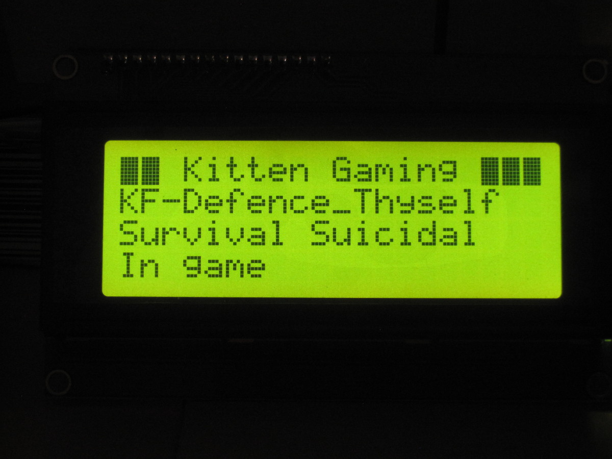
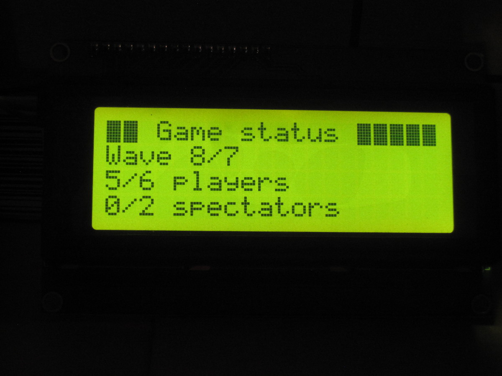
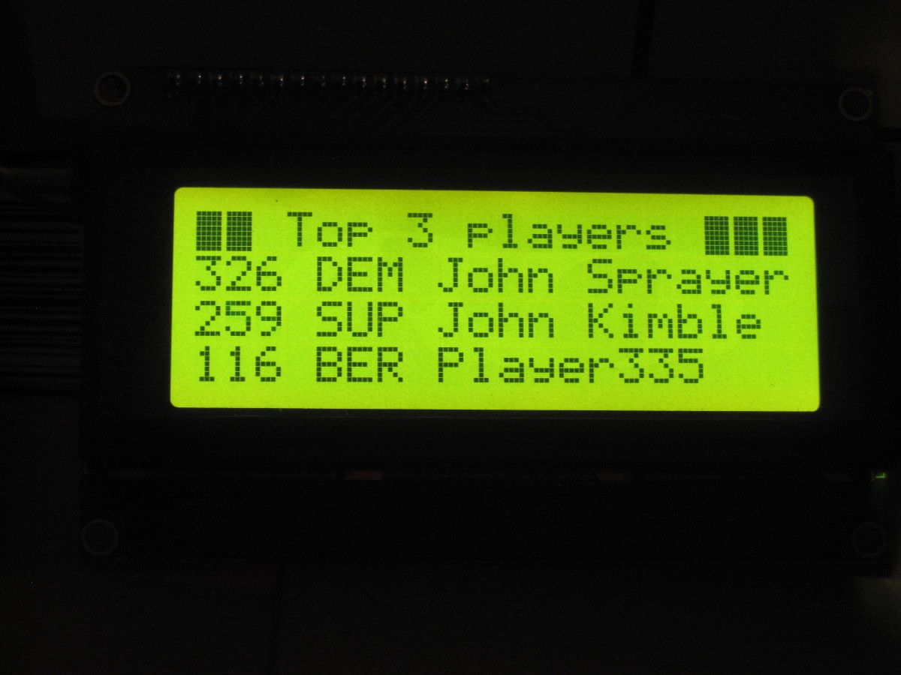
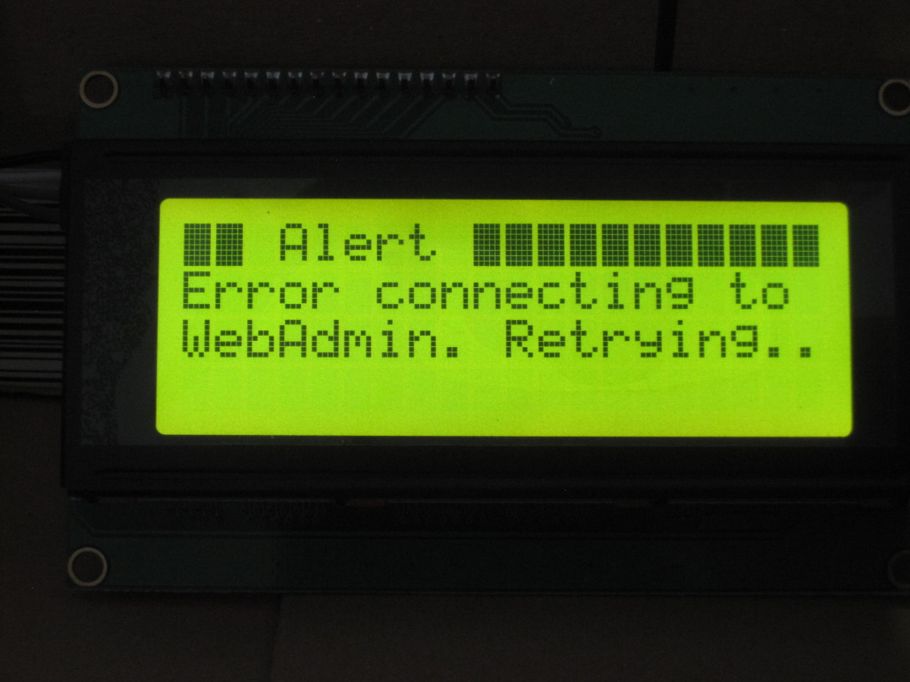

kf2monitor
==========

kf2monitor is an lcdproc client. It obtains stats like current map, wave number and the top players from a running Killing Floor 2 Dedicated Server via its WebAdmin interface, and displays them on an LCD.

The WebAdmin interface must be configured to use HTTP Authentication instead of Login Form (tab Webadmin settings -> Authentication).

Hardware
--------

You need some kind of character display connected to an lcdproc somewhere this application can access it. It doesn't have to be on the same computer as long as there is a path for TCP traffic from kf2monitor to lcdproc.

I have tried it with a HD44780 compatible 20x4 alphanumeric display connected to a [C.H.I.P.][chip] and a Raspberry Pi generation 1 model B. Any similar single-board computer outfitted with GPIOs that is capable of running Linux should suffice. How to connect the hardware and set up lcdproc is outside the scope of this README.

I should note that it *is* quite possible to run kf2monitor as well as LCDproc on one of the mentioned tiny ARM based computers. Start up is extremely slow (tens of seconds) but when it is running the very limited CPU performance of the device is not noticeable.

[chip]: https://getchip.com/

Pictures
----------

There are three screens. Screen 1 shows general information about the server (name, map, difficulty).

If there are no players on the server, the bottom line of screen 1 reads "No players" and screens 2 and 3 are hidden.

Screen 2 shows the current wave and number of connected players and spectators.

For those who haven't played Killing Floor, wave 8/7 is not an error; it is the boss wave.

Screen 3 shows the top 3 players (by kill count) and their perks.

While the KF2 server changes map its WebAdmin interface is unresponsive. When this happens kf2monitor shows an error on the display and waits for the server to come back.

Building
--------

kf2monitor is a Maven project. To build and JAR' it you do the standard procedure of `mvn compile` and `mvn package`. There is a prerequisite however.

### Prerequisite: Building lcdjava

kf2monitor uses [lcdjava][] as its lcdproc client library. lcdjava hasn't yet been published to a public Maven repository so you get to build it yourself and install it to your local Maven repository before being able to build kf2monitor. Don't worry, this isn't as difficult as it may sound. Simply clone [lcdjava's source code][lcdjava], `cd` to its working directory and run `mvn package` to build and package it into *target/lcdjava-1.0-SNAPSHOT.jar*. Now run

    $ mvn install:install-file -Dfile=target/lcdjava-1.0-SNAPSHOT.jar

to install the JAR into your local repository (in *$HOME/.m2/*). You're done!

If you do this after you already imported the project into your IDE from the Maven POM you may have to nuke the project and re-import it to get your IDE to see the lcdjava classes.

### Building kf2monitor

You should now be able to build kf2monitor by issuing a `mvn compile` in its checked out source directory. Unless I've broken the API of lcdjava of course, since it doesn't have a stable release yet.

To package it along with all dependencies into a self-contained JAR, execute `mvn package`. You may now run the program like this:

    $ java -jar target/kf2monitor-1.0-SNAPSHOT-jar-with-dependencies.jar kf2server:8080 webadmin_password 192.168.1.242

assuming that your KF2 server is resolvable by the domain name *kf2server*, has WebAdmin running on port 8080 and that your LCDproc instance is listening on the default port 13666 on 192.168.1.242.

[lcdjava]: https://github.com/boncey/lcdjava/

Rationale
---------

I'm also the semi-official maintainer of lcdjava. While working on it I needed a serious (ahem) project that uses it to see what kind of API and packaging makes sense. So I came up with this. Besides, once I thought of it I couldn't resist adding more bling to my Killing Floor 2 server, [Kitten Gaming](http://www.antoneliasson.se/kitten-gaming).

Design
------

kf2monitor is built using a classic producer-consumer concurrent design.

ProducerThread is a periodic thread that every second downloads the Killing Floor 2 server's WebAdmin interface HTML page and parses it using Jsoup. The resulting pile of List<>s and Map<,>s are put into a BlockingQueue that acts as a buffer.

ConsumerThread does blocking reads on the buffer until the program exits. It does some simple formatting and accesses setter methods in Display that basically delegate everything to lcdjava's LCD class.

Player and GameDataContainer are simple container classes.

To make everything shut down cleanly a ShutdownHook is used in App that interrupts the producer and consumer threads and waits for them to exit.

For development purposes Jsoup can be made to access a local file instead of a remote HTTP server. See the commented lines in WebAdminClient::update().

Known bugs
----------

There is very little error checking. The program might explode spectacularly if anything should go wrong at any time.

In particular:

 - If there are problems communicating with LCDproc, you get a slightly different stack trace.
 - Shutdown is a bit wobbly as there are calls to System.exit() all over the place. It *usually* exits cleanly on errors, but sometimes it doesn't. Keep your `kill -9` hammer within reach for now.
